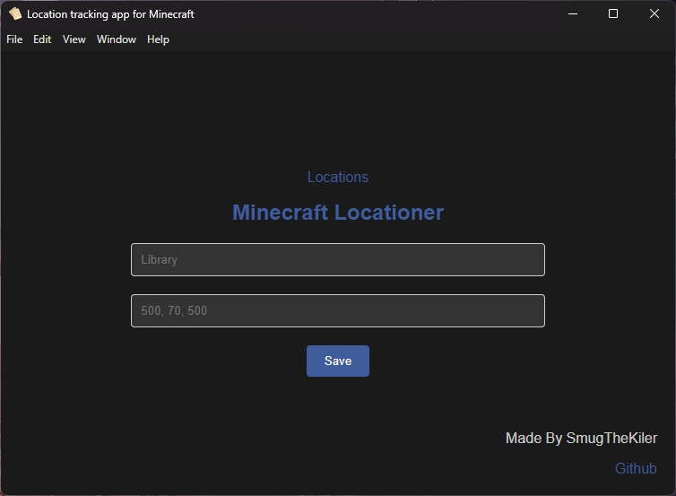
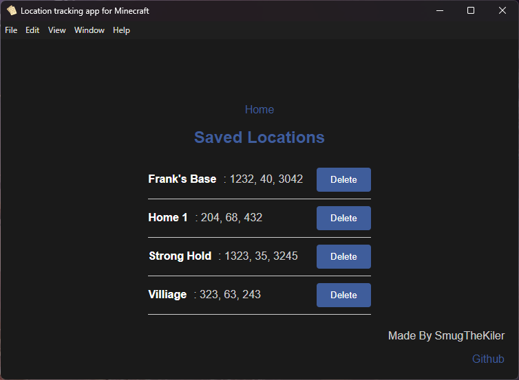

# minecraft-coordinates-app
An app that you can put coordinates in and it will remember it forever. Really useful when you have a lot of cool places to remember in your minecraft world.

# Why?
If you travel a lot in your Minecraft world like me, you also probably encountered countless cool places that you wished you could remember for later to come back to. Now what I used to do is message my friends the coordinates, but it was hard to find later on and it was definetly NOT optimal. So I solved the issue by making this. 

# This is trash
It is by no means perfect and most definetely has room to expand and improve. Feel free to contribute!

# How to deploy
To deploy this masterpiece as an app, just download the repository or copy paste all the code from the files into your own with the same names (not recommended lol) and then run `npm start`.

This should download all the dependencies and open a preview of the app. Test it out, do your adjustments and make it fit your preferences, and then run command `npm run dist`. This will start a proccess that will make a "dist" folder, inside of which will pop up the `minecraft-locations-app Setup 1.0.0.exe`, along with several other files. The `.exe` is all you really need to worry about. Thats your app download. Once you run this script, it will create the application, download all the stuff it needs, and then runs it.

You don't need to run this `.exe` all the time though, if you search in your Windows search bar it should pop up as `minecraft-locations-app`. 

Awesome!

# PREVIEW

# Contribute
Please contribute I don't know how to code